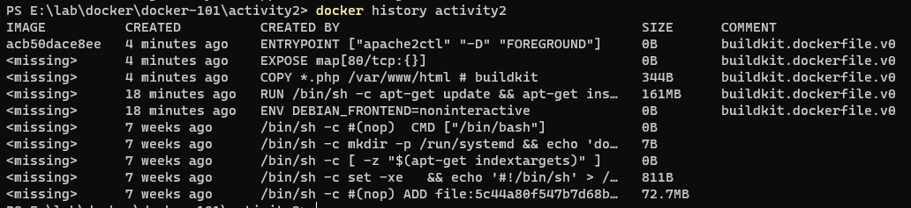

## Command

<code>docker image build -t activity2 .</code>

<code>docker container run -p 80:80 --name activity2-container activity2</code>

<code>docker container stop activity2-container</code>

<code>docker container rm activity2-container</code>

## Image Layers

