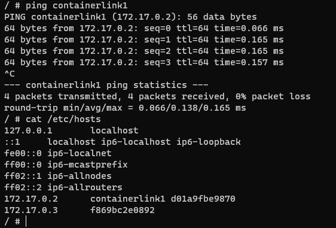
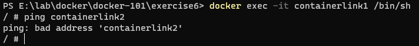

## Docker DNS

### Legacy link command

<code>docker run -itd --name containerlink1 alpine:latest</code>

<code>docker run -itd --name containerlink2 --link containerlink1 alpine:latest</code>

<code>docker exec -it containerlink2 /bin/sh</code>

<code>docker exec -it containerlink1 /bin/sh</code>

