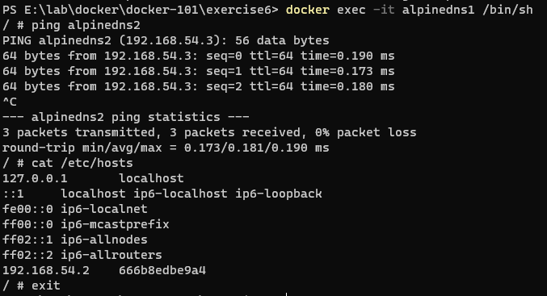
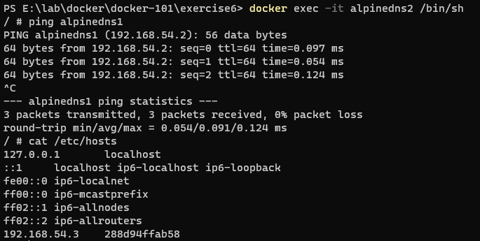
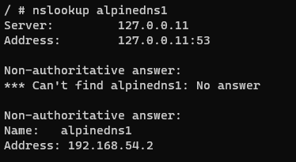

## Docker DNS

### Legacy link command

<code>docker run -itd --name containerlink1 alpine:latest</code>

<code>docker run -itd --name containerlink2 --link containerlink1 alpine:latest</code>

<code>docker exec -it containerlink2 /bin/sh</code>

<code>docker exec -it containerlink1 /bin/sh</code>

### Docker DNS

<code>docker network create dnsnet --subnet 192.168.54.0/24 --gateway 192.168.54.1</code>

<pre>
PS E:\lab\docker\docker-101\exercise6> docker network ls
NETWORK ID     NAME                                DRIVER    SCOPE
982afd4bc5ac   bridge                              bridge    local
081a82172671   dnsnet                              bridge    local
3d44030b1c3a   docker_gwbridge                     bridge    local
d3e5dc4ba24b   host                                host      local
iysgshadnfwx   ingress                             overlay   swarm
ec8b5565f6c0   none                                null      local
0eac8bd2569d   server-with-compose_default         bridge    local
daaa8d210692   server-with-configuration_default   bridge    local
PS E:\lab\docker\docker-101\exercise6> docker network inspect dnsnet
[
    {
        "Name": "dnsnet",
        "Id": "081a821726719a4612ffd8ff50e4ea2638201310321a25044dc8b43f0453e3db",
        "Created": "2021-06-23T03:25:00.2635219Z",
        "Scope": "local",
        "Driver": "bridge",
        "EnableIPv6": false,
        "IPAM": {
            "Driver": "default",
            "Options": {},
            "Config": [
                {
                    "Subnet": "192.168.54.0/24",
                    "Gateway": "192.168.54.1"
                }
            ]
        },
        "Internal": false,
        "Attachable": false,
        "Ingress": false,
        "ConfigFrom": {
            "Network": ""
        },
        "ConfigOnly": false,
        "Containers": {},
        "Options": {},
        "Labels": {}
    }
]
</pre>

<code>docker run -itd --network dnsnet --network-alias alpinedns1 --name alpinedns1 alpine:latest</code>

<code>docker run -itd --network dnsnet --network-alias alpinedns2 --name alpinedns2 alpine:latest</code>

<code>docker exec -it alpinedns1 /bin/sh</code>

<code>docker exec -it alpinedns2 /bin/sh</code>

