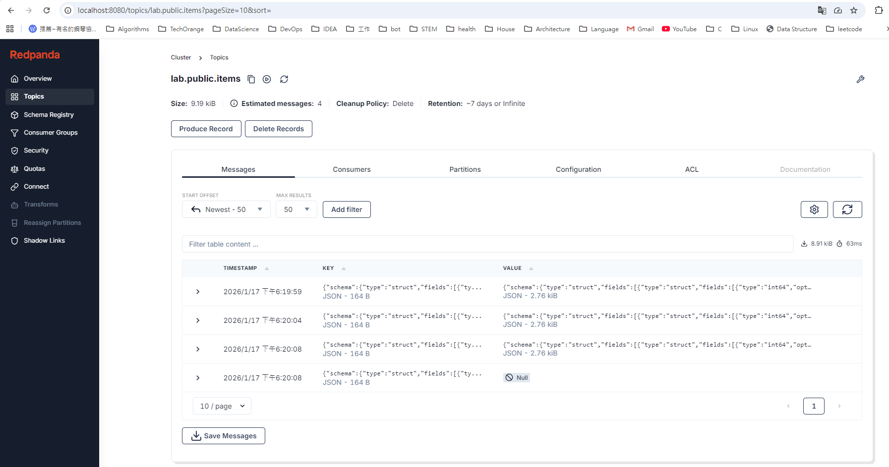

## Purpose

驗證可以由standby建立debezium source connector並debezium可以正確把change event送到kafka。

## Test

```
docker exec -it pg16 psql -U postgres -d appdb
```

```sql
INSERT INTO items(name, qty) VALUES ('apple', 10);
UPDATE items SET qty = 20 WHERE id = 1;
DELETE FROM items WHERE id = 1;
```

